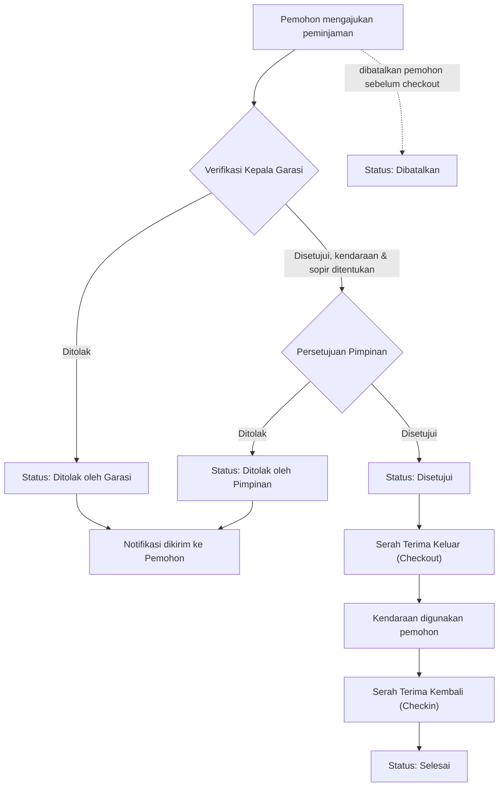
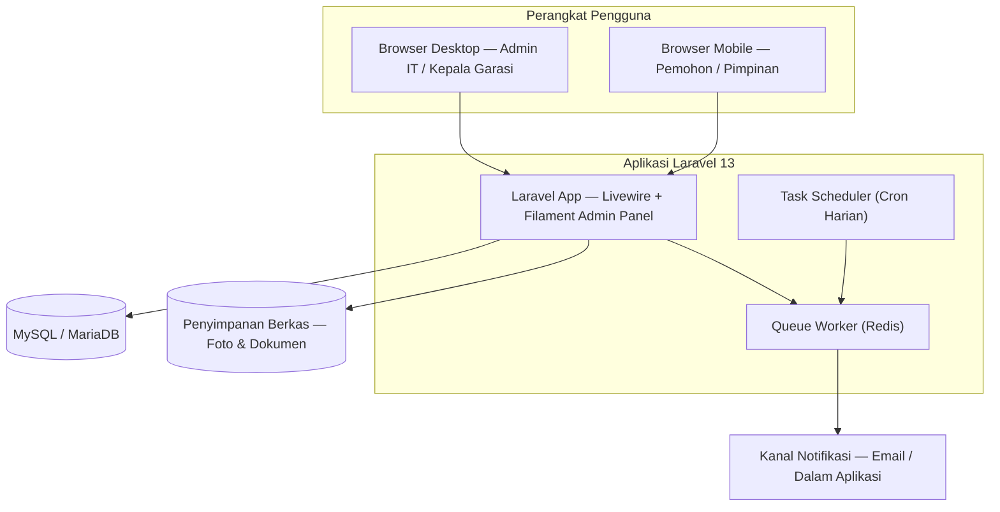
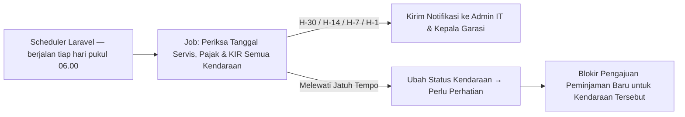
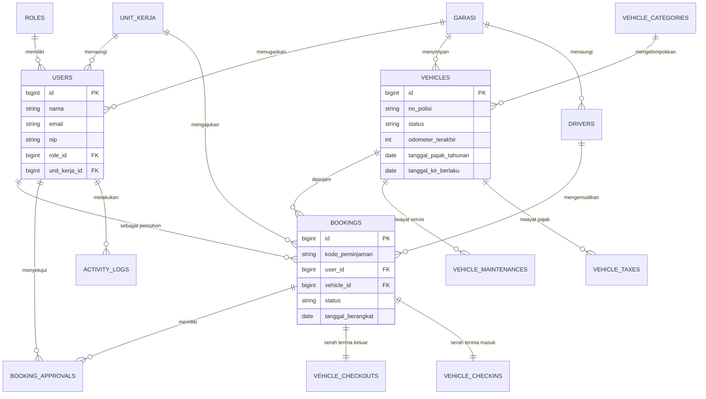

# SIPENDI — Sistem Peminjaman Kendaraan Dinas

**Product Requirements Document (PRD)**
RSUD Sidawangi — Fase 1: kendaraan dinas non-ambulans, di luar layanan antar-jemput pasien

| | |
|---|---|
| **Versi** | 1.0 — Draft |
| **Tanggal** | 22 September 2026 |
| **Cakupan** | Fase 1 · Non-Ambulans |
| **Platform** | Laravel 13 |

---

## Ringkasan Eksekutif

SIPENDI adalah aplikasi berbasis web untuk mendigitalkan proses peminjaman kendaraan dinas di RSUD Sidawangi, menggantikan pencatatan manual (buku/WhatsApp) dengan alur pengajuan, verifikasi, dan persetujuan yang terstruktur, terekam, dan dapat dilacak. Fase 1 difokuskan pada kendaraan dinas non-ambulans untuk keperluan operasional dan kedinasan — bukan untuk layanan transportasi/rujukan pasien. Sistem melibatkan empat peran: **Admin IT** (pengelola sistem & master data), **User Aplikasi** (pegawai pemohon peminjaman), **Kepala Garasi** (verifikator teknis & penanggung jawab armada), dan **Pimpinan** (penyetuju akhir). Selain alur pengajuan–persetujuan–serah terima, sistem membawa dua fitur nilai tambah yang menjadi perhatian khusus: **pengingat jadwal servis** dan **pengingat masa berlaku pajak kendaraan**, agar armada selalu dalam kondisi laik jalan dan legal. Pengembangan lanjutan pada Fase 2 akan memperluas cakupan ke modul ambulans dan layanan pasien.

## Daftar Isi

- [BAB I — Pendahuluan](#bab-i--pendahuluan)
- [BAB II — Gambaran Umum Sistem](#bab-ii--gambaran-umum-sistem)
- [BAB III — Kebutuhan Fungsional](#bab-iii--kebutuhan-fungsional)
- [BAB IV — Kebutuhan Non-Fungsional](#bab-iv--kebutuhan-non-fungsional)
- [BAB V — Arsitektur & Teknologi](#bab-v--arsitektur--teknologi)
- [BAB VI — Perancangan Basis Data](#bab-vi--perancangan-basis-data)
- [BAB VII — Desain UI/UX](#bab-vii--desain-uiux)
- [BAB VIII — Peta Jalan Pengembangan](#bab-viii--peta-jalan-pengembangan)
- [BAB IX — Indikator Keberhasilan](#bab-ix--indikator-keberhasilan)
- [BAB X — Risiko & Mitigasi](#bab-x--risiko--mitigasi)
- [Lampiran](#lampiran)

---

## BAB I — Pendahuluan

### 1.1 Latar Belakang

Pengelolaan kendaraan dinas di RSUD Sidawangi saat ini umumnya dilakukan secara manual: pengajuan lisan atau melalui pesan singkat, pencatatan di buku garasi, dan persetujuan yang tidak selalu terdokumentasi. Pendekatan ini menimbulkan beberapa persoalan operasional:

- Sulit mengetahui ketersediaan kendaraan secara real-time, sehingga berpotensi terjadi jadwal yang bentrok.
- Proses persetujuan tidak konsisten — tidak ada jejak audit siapa menyetujui, kapan, dan atas dasar apa.
- Kondisi kendaraan saat serah terima (odometer, bahan bakar, kerusakan) tidak tercatat rapi, menyulitkan pertanggungjawaban.
- Jadwal servis berkala dan masa berlaku pajak (STNK tahunan, STNK lima tahunan, KIR) dipantau secara manual dan rawan terlewat, berisiko menimbulkan denda atau kendaraan tidak laik operasi.
- Pimpinan dan Kepala Garasi tidak memiliki gambaran menyeluruh atas utilisasi armada untuk pengambilan keputusan (misalnya kebutuhan penambahan kendaraan).

SIPENDI dikembangkan untuk menjawab persoalan tersebut melalui sebuah sistem informasi yang terstruktur, transparan, dan dapat diakses dari perangkat desktop maupun mobile oleh seluruh pemangku kepentingan.

### 1.2 Tujuan

- Menyediakan alur pengajuan dan persetujuan peminjaman kendaraan dinas yang terstruktur, berjenjang, dan terdokumentasi.
- Memberikan visibilitas ketersediaan kendaraan secara real-time bagi seluruh pegawai.
- Mencatat kondisi kendaraan secara konsisten pada setiap serah terima (keluar dan kembali).
- Mengurangi risiko keterlambatan servis berkala dan pembayaran pajak kendaraan melalui pengingat otomatis.
- Menyediakan data dan laporan yang mendukung evaluasi kebutuhan armada oleh Pimpinan dan Kepala Garasi.
- Membangun fondasi sistem yang dapat dikembangkan lebih lanjut untuk modul ambulans pada Fase 2.

### 1.3 Ruang Lingkup

**Termasuk dalam Fase 1**

- Kendaraan dinas non-ambulans (kendaraan operasional, kendaraan jabatan, minibus, pickup, dsb).
- Peminjaman untuk keperluan kedinasan: perjalanan dinas, pengambilan/pengantaran barang & dokumen, kegiatan operasional rumah sakit non-klinis.
- Alur pengajuan → verifikasi Kepala Garasi → persetujuan Pimpinan → serah terima → penggunaan → pengembalian.
- Pengingat jadwal servis dan pengingat masa berlaku pajak/KIR kendaraan.
- Dashboard, riwayat, dan pelaporan penggunaan kendaraan non-ambulans.

**Di luar cakupan Fase 1**

- Kendaraan ambulans dalam bentuk apa pun.
- Layanan antar-jemput atau rujukan pasien.
- Integrasi dengan SIMRS, command center 119, atau sistem kegawatdaruratan.
- Pelacakan lokasi kendaraan secara real-time (GPS tracking).

> **Catatan Fase 2 (pengembangan mendatang):** Fase 2 akan berfokus pada modul kendaraan ambulans, mencakup permintaan layanan darurat/rujukan pasien, penentuan prioritas berdasarkan tingkat kegawatan, kemungkinan integrasi dengan SIMRS dan/atau command center kegawatdaruratan, serta pelacakan lokasi kendaraan secara real-time. Kebutuhan detail Fase 2 akan disusun dalam dokumen PRD terpisah setelah Fase 1 stabil digunakan.

### 1.4 Definisi & Istilah

| Istilah | Keterangan |
|---|---|
| SIPENDI | Sistem Peminjaman Kendaraan Dinas — nama aplikasi yang dibahas dalam dokumen ini. |
| Kendaraan Dinas | Kendaraan milik/dikuasai RSUD Sidawangi yang digunakan untuk keperluan operasional, di luar ambulans. |
| Kepala Garasi | Penanggung jawab teknis armada kendaraan; memverifikasi kesiapan kendaraan dan menetapkan kendaraan/sopir untuk suatu pengajuan. |
| Pimpinan | Pejabat yang berwenang memberikan persetujuan akhir atas pengajuan peminjaman. |
| Serah Terima Keluar (Checkout) | Proses pencatatan kondisi kendaraan saat diserahkan kepada peminjam sebelum digunakan. |
| Serah Terima Masuk (Checkin) | Proses pencatatan kondisi kendaraan saat dikembalikan setelah digunakan. |
| STNK Tahunan | Pengesahan pajak kendaraan bermotor yang wajib diperbarui setiap tahun. |
| STNK Lima Tahunan | Perpanjangan STNK sekaligus penggantian plat nomor setiap lima tahun, disertai cek fisik kendaraan. |
| KIR | Uji berkala kelaikan kendaraan bermotor tertentu (umumnya untuk kendaraan angkutan/operasional tertentu). |
| Swakemudi | Peminjaman kendaraan tanpa didampingi sopir dinas; pemohon mengemudikan sendiri. |

---

## BAB II — Gambaran Umum Sistem

### 2.1 Aktor & Peran Pengguna

**Admin IT** — mengelola sistem secara teknis dan administratif.
- Mengelola akun pengguna & peran
- Mengelola master data kendaraan, garasi, unit kerja, sopir
- Mengelola pengaturan pengingat servis/pajak
- Memantau log aktivitas sistem

**User Aplikasi (Pemohon)** — pegawai unit kerja yang mengajukan peminjaman kendaraan.
- Mengajukan permohonan peminjaman
- Memantau status pengajuan
- Melihat riwayat peminjaman pribadi
- Menerima notifikasi status

**Kepala Garasi** — penanggung jawab teknis armada & verifikator tahap pertama.
- Memverifikasi pengajuan & menetapkan kendaraan/sopir
- Melakukan serah terima keluar & masuk
- Mencatat servis & pajak kendaraan
- Menerima pengingat servis/pajak

**Pimpinan** — penyetuju akhir atas pengajuan yang telah diverifikasi.
- Menyetujui/menolak pengajuan peminjaman
- Melihat dashboard & statistik penggunaan armada
- Menerima ringkasan laporan berkala

### 2.2 Alur Proses Bisnis

Alur berikut menggambarkan siklus hidup sebuah pengajuan peminjaman, dari pengajuan hingga selesai.



Setiap perubahan status memicu notifikasi ke pihak terkait (lihat Lampiran B — Matriks Notifikasi).

| Status Peminjaman | Deskripsi |
|---|---|
| Diajukan | Pengajuan baru dibuat pemohon, menunggu verifikasi Kepala Garasi. |
| Diverifikasi Garasi | Kepala Garasi menyetujui secara teknis & menetapkan kendaraan/sopir; menunggu persetujuan Pimpinan. |
| Ditolak Garasi | Ditolak pada tahap verifikasi teknis (misal tidak ada kendaraan tersedia). |
| Disetujui | Disetujui Pimpinan, siap untuk serah terima keluar. |
| Ditolak Pimpinan | Ditolak pada tahap persetujuan akhir. |
| Kendaraan Keluar | Serah terima keluar telah dilakukan, kendaraan sedang digunakan. |
| Kendaraan Kembali | Serah terima masuk telah dilakukan, menunggu penutupan administrasi. |
| Selesai | Siklus peminjaman selesai secara administratif. |
| Dibatalkan | Dibatalkan oleh pemohon sebelum serah terima keluar. |

---

## BAB III — Kebutuhan Fungsional

### 3.1 User Stories per Peran

**Admin IT**
- Sebagai Admin IT, saya ingin mengelola akun & peran pengguna, sehingga akses sistem sesuai dengan tanggung jawab masing-masing pegawai.
- Sebagai Admin IT, saya ingin mengelola data master kendaraan, garasi, dan unit kerja, sehingga data yang digunakan seluruh sistem selalu akurat.
- Sebagai Admin IT, saya ingin mengatur ambang waktu pengingat servis dan pajak, sehingga notifikasi dikirim sesuai kebijakan rumah sakit.
- Sebagai Admin IT, saya ingin melihat log aktivitas sistem, sehingga saya dapat menelusuri perubahan data jika terjadi ketidaksesuaian.

**User Aplikasi (Pemohon)**
- Sebagai pemohon, saya ingin mengajukan peminjaman kendaraan secara online, sehingga saya tidak perlu datang langsung ke garasi.
- Sebagai pemohon, saya ingin melihat kalender ketersediaan kendaraan, sehingga saya dapat memilih jadwal yang tidak bentrok.
- Sebagai pemohon, saya ingin memantau status pengajuan saya secara real-time, sehingga saya tahu kapan harus bersiap.
- Sebagai pemohon, saya ingin menerima notifikasi saat pengajuan disetujui/ditolak, sehingga saya dapat segera menindaklanjuti.
- Sebagai pemohon, saya ingin melihat riwayat peminjaman saya, sehingga saya memiliki catatan untuk keperluan pelaporan pribadi.

**Kepala Garasi**
- Sebagai Kepala Garasi, saya ingin melihat daftar pengajuan yang menunggu verifikasi, sehingga saya dapat segera menetapkan kendaraan & sopir yang sesuai.
- Sebagai Kepala Garasi, saya ingin mencatat kondisi kendaraan saat serah terima keluar dan masuk, sehingga kondisi armada dapat dipertanggungjawabkan.
- Sebagai Kepala Garasi, saya ingin menerima pengingat jadwal servis dan pajak, sehingga saya dapat menjadwalkan perawatan sebelum jatuh tempo.
- Sebagai Kepala Garasi, saya ingin mencatat riwayat servis dan pembayaran pajak kendaraan, sehingga riwayat perawatan armada terdokumentasi lengkap.

**Pimpinan**
- Sebagai Pimpinan, saya ingin menyetujui atau menolak pengajuan peminjaman dari mana saja melalui perangkat mobile, sehingga proses persetujuan tidak tertunda karena saya sedang di luar kantor.
- Sebagai Pimpinan, saya ingin melihat dashboard ringkas utilisasi kendaraan dinas, sehingga saya memiliki dasar untuk mengevaluasi kebutuhan armada.
- Sebagai Pimpinan, saya ingin melihat riwayat alasan penolakan/persetujuan, sehingga saya memiliki jejak keputusan yang konsisten.

### 3.2 Fitur Utama

**3.2.1 Manajemen Master Data** — pengelolaan data acuan oleh Admin IT.
- Data kendaraan, kategori kendaraan, dan garasi/pool
- Data unit kerja & pengguna beserta perannya
- Data sopir dinas (opsional, jika RSUD menyediakan sopir pool)

**3.2.2 Pengajuan Peminjaman** — formulir pengajuan oleh pemohon.
- Tujuan, tanggal & jam berangkat–kembali, jumlah penumpang
- Pilihan swakemudi atau didampingi sopir dinas
- Unggah surat tugas (opsional)
- Kalender ketersediaan kendaraan secara visual

**3.2.3 Persetujuan Berjenjang** — verifikasi teknis oleh Kepala Garasi, dilanjutkan persetujuan akhir Pimpinan.
- Penetapan kendaraan & sopir oleh Kepala Garasi
- Penolakan disertai alasan pada tiap tahap
- Notifikasi otomatis pada setiap perubahan status

**3.2.4 Serah Terima Kendaraan** — checklist digital saat kendaraan keluar & kembali.
- Input odometer & level bahan bakar
- Checklist kelengkapan (ban serep, dongkrak, P3K, dsb)
- Unggah foto kondisi kendaraan
- Catatan kerusakan jika ditemukan saat kendaraan kembali

**3.2.5 Riwayat & Pelacakan** — jejak lengkap setiap peminjaman.
- Riwayat per pengguna dan per kendaraan
- Status real-time yang dapat dipantau pemohon

**3.2.6 Dashboard & Laporan** — ringkasan data sesuai kebutuhan tiap peran.
- Dashboard berbeda untuk tiap peran (lihat Bab VII)
- Ekspor laporan utilisasi kendaraan ke PDF/Excel

**3.2.7 Notifikasi** — pemberitahuan otomatis lintas kanal.
- Notifikasi dalam aplikasi & email
- Terhubung ke setiap perubahan status pengajuan

### 3.3 Fitur Tambahan (Value-Added)

**3.3.1 Pengingat Jadwal Servis ⭑** — servis dijadwalkan berbasis tanggal dan/atau jarak tempuh (odometer) per kendaraan.
- Pengaturan interval servis per kendaraan (mis. tiap 6 bulan / 5.000 km)
- Notifikasi bertahap H-30, H-14, dan H-1 ke Admin IT & Kepala Garasi
- Riwayat servis tersimpan (bengkel, biaya, pekerjaan, dokumen nota)

**3.3.2 Pengingat Pajak Kendaraan ⭑** — mencakup pajak tahunan (STNK), pajak lima tahunan, dan KIR bila berlaku.
- Notifikasi bertahap H-30, H-14, H-7, dan H-1
- Status kendaraan otomatis berubah menjadi *Perlu Perhatian* bila melewati jatuh tempo
- Kendaraan dengan pajak/KIR kedaluwarsa otomatis tidak dapat diajukan untuk dipinjam

**3.3.3 Pengingat Masa Berlaku SIM Sopir** — berlaku jika RSUD memiliki sopir dinas pool. Notifikasi H-30 sebelum SIM sopir berakhir masa berlakunya.

**3.3.4 Checklist & Rating Kondisi Kendaraan** — penilaian kondisi kendaraan (1–5) oleh petugas garasi setiap serah terima masuk, membentuk riwayat kondisi armada dari waktu ke waktu.

**3.3.5 Eskalasi Otomatis Persetujuan** — jika pengajuan belum direspons dalam jangka waktu tertentu (dapat dikonfigurasi), sistem mengirim pengingat susulan kepada Kepala Garasi/Pimpinan terkait.

**3.3.6 Kode QR Kendaraan** — setiap kendaraan memiliki kode QR fisik di garasi untuk mempercepat proses serah terima melalui pemindaian oleh petugas.

**3.3.7 Log Aktivitas & Audit Trail** — seluruh perubahan data penting (persetujuan, master data, serah terima) tercatat otomatis: siapa, kapan, dan perubahan apa yang dilakukan.

**3.3.8 Statistik Utilisasi per Unit Kerja** — rekap frekuensi & durasi pemakaian kendaraan per unit kerja, sebagai bahan evaluasi kebutuhan armada oleh Pimpinan.

**3.3.9 Antarmuka Mobile-First / PWA** — halaman persetujuan dan verifikasi dioptimalkan untuk layar mobile, memungkinkan Pimpinan dan Kepala Garasi menindaklanjuti pengajuan dari mana saja.

### 3.4 Matriks Hak Akses

Legenda: **Penuh** = tambah/ubah/hapus · **Input** = dapat menambah/mengisi data · **Tindak Lanjut** = menyetujui/menolak/memverifikasi · **Lihat** = hanya melihat · — = tidak memiliki akses.

| Fitur | Admin IT | User Aplikasi | Kepala Garasi | Pimpinan |
|---|---|---|---|---|
| Kelola master data (kendaraan, garasi, unit kerja, pengguna) | Penuh | — | — | — |
| Ajukan peminjaman | — | Input | — | — |
| Verifikasi & tetapkan kendaraan/sopir | — | — | Tindak Lanjut | — |
| Persetujuan akhir | — | — | Lihat | Tindak Lanjut |
| Serah terima keluar / masuk | — | — | Input | — |
| Kalender ketersediaan kendaraan | Lihat | Lihat | Lihat | Lihat |
| Kelola data servis & pajak | Input | — | Input | — |
| Terima pengingat servis/pajak | Ya | — | Ya | — |
| Dashboard & laporan | Lihat | Lihat* | Lihat | Lihat |
| Ekspor laporan (PDF/Excel) | Ya | — | Ya | Ya |
| Kelola pengguna & peran | Penuh | — | — | — |
| Lihat log aktivitas/audit | Lihat | — | — | Lihat |

\* User Aplikasi hanya melihat riwayat & status pengajuan miliknya sendiri.

---

## BAB IV — Kebutuhan Non-Fungsional

**Keamanan**
- Autentikasi berbasis akun dengan kata sandi terenkripsi (hashing)
- Kontrol akses berbasis peran (role-based access control) untuk 4 peran
- Audit trail untuk seluruh aksi yang mengubah data penting
- Sesi otomatis berakhir setelah periode tidak aktif tertentu
- Rekomendasi otentikasi dua faktor untuk peran Admin IT & Pimpinan (opsional, tahap lanjutan)

**Performa & Skalabilitas**
- Waktu muat halaman utama < 2 detik pada koneksi standar rumah sakit
- Proses notifikasi/pengingat dijalankan secara asinkron (queue) agar tidak membebani respons pengguna
- Arsitektur mendukung penambahan jumlah kendaraan & pengguna tanpa perubahan struktural

**Ketersediaan & Keandalan**
- Target ketersediaan sistem 99% pada jam kerja
- Backup basis data terjadwal (harian) dengan retensi minimal 30 hari
- Pencatatan log kegagalan pengiriman notifikasi untuk ditindaklanjuti Admin IT

**Usabilitas & Aksesibilitas**
- Antarmuka responsif untuk desktop, tablet, dan mobile
- Alur persetujuan dioptimalkan untuk penggunaan satu tangan di perangkat mobile
- Kontras warna & ukuran teks memenuhi kebutuhan keterbacaan umum

**Kepatuhan & Privasi Data**
- Data pribadi pengguna dikelola sesuai prinsip perlindungan data pribadi yang berlaku
- Akses data dibatasi sesuai kebutuhan peran (prinsip least privilege)
- Dokumen kendaraan & foto disimpan dengan akses tervalidasi

**Kompatibilitas**
- Mendukung browser modern (Chrome, Edge, Safari, Firefox versi dua tahun terakhir)
- Tampilan tetap fungsional pada perangkat Android/iOS versi umum yang digunakan pegawai

---

## BAB V — Arsitektur & Teknologi

### 5.1 Tumpukan Teknologi

Sesuai permintaan penggunaan Laravel versi terbaru — per September 2026, rilis utama terkini adalah **Laravel 13** (dirilis Maret 2026, membutuhkan PHP 8.3–8.5), dengan Laravel 12 masih dalam status didukung penuh. Rekomendasi tumpukan teknologi:

| Lapisan | Teknologi | Keterangan |
|---|---|---|
| Bahasa & Framework Backend | PHP 8.3+ · Laravel 13 | Framework utama aplikasi |
| Panel Admin IT | Filament | Backoffice untuk kelola master data & pengaturan sistem secara cepat & konsisten |
| Interaktivitas Frontend | Livewire 3 + Alpine.js | Form dinamis (kalender, checklist) tanpa membangun SPA terpisah |
| Styling | Tailwind CSS | Utility-first, mudah disesuaikan dengan identitas visual RSUD Sidawangi |
| Basis Data | MySQL 8 / MariaDB 10.11 | Basis data relasional untuk data transaksional |
| Antrean & Cache | Redis + Laravel Queue | Memproses notifikasi & pengingat di latar belakang |
| Penjadwalan | Laravel Task Scheduler | Tugas harian memeriksa jatuh tempo servis & pajak |
| Otentikasi & Otorisasi | Laravel Fortify + spatie/laravel-permission | Login aman & pengelolaan peran/izin granular |
| Notifikasi | Laravel Notification | Kanal database & email; kanal WhatsApp dapat ditambahkan melalui gateway pihak ketiga pada iterasi berikutnya |
| Ekspor Laporan | barryvdh/laravel-dompdf · maatwebsite/excel | Ekspor laporan ke PDF & Excel |
| Audit Trail | spatie/laravel-activitylog | Pencatatan aktivitas otomatis pada model penting |
| Penyimpanan Berkas | Local disk / S3-compatible | Foto kondisi kendaraan, dokumen pajak & servis |
| Server Produksi | Nginx + PHP-FPM + Supervisor | Supervisor menjaga proses queue worker tetap berjalan |

### 5.2 Arsitektur Sistem



### 5.3 Modul Notifikasi & Penjadwalan

Inti dari fitur pengingat servis dan pajak adalah tugas terjadwal (scheduled job) yang berjalan setiap hari, memeriksa tanggal jatuh tempo tiap kendaraan terhadap pengaturan pada tabel `reminder_settings`, lalu mengirim notifikasi bertahap sebelum jatuh tempo.



Ambang pengingat (H-30/H-14/H-7/H-1) bersifat dapat dikonfigurasi oleh Admin IT melalui tabel `reminder_settings`, tanpa memerlukan perubahan kode.

---

## BAB VI — Perancangan Basis Data

### 6.1 Diagram Relasi Entitas



Diagram menampilkan entitas inti beserta atributnya; entitas pendukung (peran, unit kerja, garasi, kategori kendaraan, sopir, log aktivitas) ditampilkan sebagai relasi saja untuk menjaga keterbacaan. Rincian lengkap seluruh kolom tersedia pada Kamus Data (6.2).

### 6.2 Kamus Data

Konvensi: `id` pada setiap tabel adalah `bigint unsigned`, auto-increment, primary key (PK). Setiap tabel memiliki kolom `created_at` & `updated_at` bertipe `timestamp` mengikuti konvensi Eloquent ORM Laravel.

#### 6.2.1 Tabel `roles`

| Kolom | Tipe | Kunci | Keterangan |
|---|---|---|---|
| id | bigint | PK | Identitas peran |
| nama_role | varchar(50) | — | Admin IT, User Aplikasi, Kepala Garasi, Pimpinan |
| slug | varchar(50) | Unique | admin_it, user_aplikasi, kepala_garasi, pimpinan |
| deskripsi | text | — | Nullable |
| created_at, updated_at | timestamp | — | Waktu pembuatan & pembaruan data |

#### 6.2.2 Tabel `unit_kerja`

| Kolom | Tipe | Kunci | Keterangan |
|---|---|---|---|
| id | bigint | PK | Identitas unit kerja |
| nama_unit | varchar(100) | — | Mis. Instalasi Farmasi, Bagian Umum |
| kode_unit | varchar(20) | Unique | Kode singkat unit kerja |
| keterangan | text | — | Nullable |
| created_at, updated_at | timestamp | — | — |

#### 6.2.3 Tabel `garasi`

| Kolom | Tipe | Kunci | Keterangan |
|---|---|---|---|
| id | bigint | PK | Identitas garasi/pool kendaraan |
| nama_garasi | varchar(100) | — | Mis. Garasi Utama RSUD Sidawangi |
| alamat | text | — | Lokasi garasi |
| penanggung_jawab_id | bigint | FK → users.id | Nullable; Kepala Garasi penanggung jawab |
| no_telp | varchar(20) | — | Nullable |
| created_at, updated_at | timestamp | — | — |

#### 6.2.4 Tabel `users`

| Kolom | Tipe | Kunci | Keterangan |
|---|---|---|---|
| id | bigint | PK | Identitas pengguna |
| unit_kerja_id | bigint | FK → unit_kerja.id | Nullable |
| role_id | bigint | FK → roles.id | Menentukan peran pengguna |
| garasi_id | bigint | FK → garasi.id | Nullable; relevan untuk Kepala Garasi |
| nama | varchar(100) | — | Nama lengkap |
| nip | varchar(30) | Unique | Nullable |
| email | varchar(100) | Unique | Digunakan untuk login |
| password | varchar(255) | — | Ter-hash (bcrypt/argon2) |
| no_hp | varchar(20) | — | Nullable |
| foto | varchar(255) | — | Nullable, path berkas |
| status | enum | — | aktif, nonaktif |
| email_verified_at | timestamp | — | Nullable |
| created_at, updated_at | timestamp | — | — |

#### 6.2.5 Tabel `vehicle_categories`

| Kolom | Tipe | Kunci | Keterangan |
|---|---|---|---|
| id | bigint | PK | — |
| nama_kategori | varchar(50) | — | Mis. Minibus, Sedan, Pickup, Truk Operasional |
| keterangan | text | — | Nullable |
| created_at, updated_at | timestamp | — | — |

#### 6.2.6 Tabel `vehicles`

| Kolom | Tipe | Kunci | Keterangan |
|---|---|---|---|
| id | bigint | PK | Identitas kendaraan |
| garasi_id | bigint | FK → garasi.id | — |
| kategori_id | bigint | FK → vehicle_categories.id | — |
| no_polisi | varchar(15) | Unique | Nomor plat kendaraan |
| no_rangka | varchar(50) | — | Nullable |
| no_mesin | varchar(50) | — | Nullable |
| no_bpkb | varchar(50) | — | Nullable |
| merk | varchar(50) | — | Mis. Toyota, Daihatsu |
| tipe_model | varchar(50) | — | Mis. Avanza, Hilux |
| tahun_pembuatan | year | — | — |
| warna | varchar(30) | — | — |
| bahan_bakar | enum | — | bensin, solar, listrik, hybrid |
| kapasitas_penumpang | tinyint | — | — |
| foto_utama | varchar(255) | — | Nullable |
| status | enum | — | tersedia, dipinjam, maintenance, perlu_perhatian, nonaktif |
| odometer_terakhir | int | — | Kilometer terakhir tercatat |
| interval_service_km | int | — | Nullable, mis. 5000 |
| interval_service_bulan | tinyint | — | Nullable, mis. 6 |
| tanggal_service_terakhir | date | — | Nullable |
| odometer_service_terakhir | int | — | Nullable |
| tanggal_pajak_tahunan | date | — | Masa berlaku STNK tahun berjalan |
| tanggal_pajak_5tahunan | date | — | Nullable |
| tanggal_kir_berlaku | date | — | Nullable, jika kendaraan wajib uji KIR |
| catatan | text | — | Nullable |
| created_at, updated_at | timestamp | — | — |

#### 6.2.7 Tabel `drivers`

| Kolom | Tipe | Kunci | Keterangan |
|---|---|---|---|
| id | bigint | PK | — |
| garasi_id | bigint | FK → garasi.id | Nullable |
| user_id | bigint | FK → users.id | Nullable; jika sopir memiliki akun login |
| nama | varchar(100) | — | — |
| no_hp | varchar(20) | — | — |
| no_sim | varchar(30) | — | — |
| jenis_sim | varchar(10) | — | Mis. A, B1, B2 |
| masa_berlaku_sim | date | — | Untuk pengingat 3.3.3 |
| foto | varchar(255) | — | Nullable |
| status | enum | — | aktif, cuti, nonaktif |
| created_at, updated_at | timestamp | — | — |

#### 6.2.8 Tabel `bookings` (Peminjaman)

| Kolom | Tipe | Kunci | Keterangan |
|---|---|---|---|
| id | bigint | PK | — |
| kode_peminjaman | varchar(30) | Unique | Format: SPD/{unit}/{tahun}{bulan}/{urut} |
| user_id | bigint | FK → users.id | Pemohon |
| unit_kerja_id | bigint | FK → unit_kerja.id | — |
| vehicle_id | bigint | FK → vehicles.id | Nullable hingga ditetapkan Kepala Garasi |
| driver_id | bigint | FK → drivers.id | Nullable, jika swakemudi |
| jenis_pengemudi | enum | — | sopir_dinas, swakemudi |
| tujuan_perjalanan | text | — | — |
| kota_tujuan | varchar(100) | — | — |
| tanggal_berangkat | date | — | — |
| jam_berangkat | time | — | — |
| tanggal_kembali_rencana | date | — | — |
| jam_kembali_rencana | time | — | — |
| jumlah_penumpang | tinyint | — | — |
| tingkat_prioritas | enum | — | normal, mendesak (default normal) |
| no_surat_tugas | varchar(50) | — | Nullable |
| file_surat_tugas | varchar(255) | — | Nullable |
| status | enum | — | diajukan, diverifikasi_garasi, ditolak_garasi, disetujui, ditolak_pimpinan, kendaraan_keluar, kendaraan_kembali, selesai, dibatalkan |
| catatan_pemohon | text | — | Nullable |
| created_at, updated_at | timestamp | — | — |

#### 6.2.9 Tabel `booking_approvals`

| Kolom | Tipe | Kunci | Keterangan |
|---|---|---|---|
| id | bigint | PK | — |
| booking_id | bigint | FK → bookings.id | — |
| approver_id | bigint | FK → users.id | — |
| role_approval | enum | — | kepala_garasi, pimpinan |
| tindakan | enum | — | setuju, tolak |
| catatan | text | — | Nullable, wajib diisi jika menolak |
| waktu_tindakan | datetime | — | — |
| created_at | timestamp | — | — |

#### 6.2.10 Tabel `vehicle_checkouts` (Serah Terima Keluar)

| Kolom | Tipe | Kunci | Keterangan |
|---|---|---|---|
| id | bigint | PK | — |
| booking_id | bigint | FK → bookings.id, Unique | Satu checkout per peminjaman |
| petugas_id | bigint | FK → users.id | Petugas garasi yang menyerahkan |
| odometer_keluar | int | — | — |
| level_bbm_keluar | enum | — | E, 1/4, 1/2, 3/4, F |
| kondisi_kendaraan | enum | — | baik, perlu_perhatian |
| checklist_kelengkapan | json | — | Ban serep, dongkrak, segitiga pengaman, kotak P3K, dsb |
| foto_kondisi | json | — | Nullable, kumpulan path foto |
| catatan | text | — | Nullable |
| waktu_keluar | datetime | — | — |
| created_at | timestamp | — | — |

#### 6.2.11 Tabel `vehicle_checkins` (Serah Terima Masuk)

| Kolom | Tipe | Kunci | Keterangan |
|---|---|---|---|
| id | bigint | PK | — |
| booking_id | bigint | FK → bookings.id, Unique | Satu checkin per peminjaman |
| petugas_id | bigint | FK → users.id | — |
| odometer_masuk | int | — | Dipakai memperbarui odometer_terakhir kendaraan |
| level_bbm_masuk | enum | — | E, 1/4, 1/2, 3/4, F |
| kondisi_kendaraan | enum | — | baik, perlu_perhatian |
| ada_kerusakan | boolean | — | Default false |
| deskripsi_kerusakan | text | — | Nullable |
| checklist_kelengkapan | json | — | — |
| foto_kondisi | json | — | Nullable |
| rating_kondisi | tinyint | — | Nullable, skala 1–5 |
| catatan | text | — | Nullable |
| waktu_masuk | datetime | — | — |
| created_at | timestamp | — | — |

#### 6.2.12 Tabel `vehicle_maintenances` (Riwayat Servis)

| Kolom | Tipe | Kunci | Keterangan |
|---|---|---|---|
| id | bigint | PK | — |
| vehicle_id | bigint | FK → vehicles.id | — |
| jenis_service | enum | — | rutin, berkala, insidentil, perbaikan_kerusakan |
| tanggal_service | date | — | — |
| odometer_saat_service | int | — | — |
| bengkel | varchar(100) | — | Nullable |
| biaya | decimal(12,2) | — | Nullable |
| deskripsi_pekerjaan | text | — | — |
| dokumen_nota | varchar(255) | — | Nullable |
| dicatat_oleh | bigint | FK → users.id | — |
| created_at, updated_at | timestamp | — | — |

#### 6.2.13 Tabel `vehicle_taxes` (Riwayat & Jadwal Pajak)

| Kolom | Tipe | Kunci | Keterangan |
|---|---|---|---|
| id | bigint | PK | — |
| vehicle_id | bigint | FK → vehicles.id | — |
| jenis_pajak | enum | — | tahunan, lima_tahunan, kir |
| tanggal_bayar | date | — | Nullable jika belum dibayar/belum jatuh tempo |
| masa_berlaku_sampai | date | — | Dasar perhitungan pengingat |
| biaya | decimal(12,2) | — | Nullable |
| dokumen | varchar(255) | — | Nullable, scan STNK/bukti bayar |
| status | enum | — | aktif, akan_jatuh_tempo, kadaluarsa |
| dicatat_oleh | bigint | FK → users.id | Nullable |
| created_at, updated_at | timestamp | — | — |

#### 6.2.14 Tabel `reminder_settings`

| Kolom | Tipe | Kunci | Keterangan |
|---|---|---|---|
| id | bigint | PK | — |
| tipe_reminder | enum | — | service, pajak_tahunan, pajak_5tahunan, kir, sim_sopir |
| h_minus_tahap1 | int | — | Default 30 (hari) |
| h_minus_tahap2 | int | — | Default 14 (hari) |
| h_minus_tahap3 | int | — | Default 1 (hari) |
| target_role | json | — | Mis. ["admin_it","kepala_garasi"] |
| aktif | boolean | — | Default true |
| created_at, updated_at | timestamp | — | — |

#### 6.2.15 Tabel `activity_logs`

| Kolom | Tipe | Kunci | Keterangan |
|---|---|---|---|
| id | bigint | PK | — |
| user_id | bigint | FK → users.id | Nullable (aksi sistem) |
| aktivitas | varchar(255) | — | Mis. "Menyetujui Peminjaman SPD/2026/09/0032" |
| model_terkait | varchar(100) | — | Nullable, mis. Booking, Vehicle |
| model_id | bigint | — | Nullable |
| data_sebelum | json | — | Nullable |
| data_sesudah | json | — | Nullable |
| ip_address | varchar(45) | — | Nullable |
| created_at | timestamp | — | — |

#### 6.2.16 Tabel `settings`

| Kolom | Tipe | Kunci | Keterangan |
|---|---|---|---|
| id | bigint | PK | — |
| key | varchar(100) | Unique | Mis. nama_instansi, logo_instansi |
| value | text | — | Nullable |
| grup | varchar(50) | — | Nullable, mis. umum, notifikasi |
| created_at, updated_at | timestamp | — | — |

> **Catatan implementasi:** Notifikasi dalam aplikasi disarankan memanfaatkan tabel bawaan Laravel Notification (`notifications`) alih-alih tabel kustom, agar kompatibel dengan ekosistem paket Laravel. Struktur di atas dapat diperluas pada Fase 2 dengan tabel-tabel khusus modul ambulans (mis. `ambulance_requests`, `patient_transport_logs`) tanpa mengubah struktur inti Fase 1.

---

## BAB VII — Desain UI/UX

### 7.1 Prinsip Desain

- **Mobile-first untuk alur persetujuan** — Kepala Garasi dan Pimpinan sering bertugas di luar meja kerja; halaman verifikasi & persetujuan harus nyaman digunakan satu tangan di ponsel.
- **Status selalu terlihat** — setiap peminjaman & kendaraan memiliki indikator warna yang konsisten di seluruh halaman.
- **Minim langkah untuk aksi inti** — pengajuan peminjaman dan persetujuan dirancang dapat diselesaikan dalam waktu singkat, tanpa kolom yang tidak perlu.
- **Konsisten dengan identitas RSUD Sidawangi** — palet warna netral & profesional, sesuai konteks fasilitas kesehatan pemerintah.

### 7.2 Palet Warna Status

Warna status digunakan secara konsisten pada badge, kartu, dan indikator kalender di seluruh aplikasi.

- 🟢 Hijau — Tersedia / Disetujui
- 🔵 Biru — Dalam Proses / Dipinjam
- 🟠 Oranye — Menunggu / Perlu Perhatian
- 🔴 Merah — Ditolak / Kedaluwarsa
- ⚪ Abu-abu — Nonaktif / Dibatalkan

### 7.3 Peta Halaman per Peran

| Peran | Halaman Utama |
|---|---|
| Admin IT | Dashboard sistem · Kelola Pengguna & Peran · Kelola Kendaraan/Garasi/Unit Kerja · Pengaturan Pengingat · Log Aktivitas |
| User Aplikasi | Beranda & Notifikasi · Formulir Ajukan Peminjaman · Kalender Ketersediaan · Riwayat Peminjaman Saya |
| Kepala Garasi | Antrean Verifikasi · Serah Terima Keluar/Masuk · Riwayat Servis & Pajak Kendaraan · Kondisi Armada |
| Pimpinan | Antrean Persetujuan · Dashboard Utilisasi Armada · Riwayat Keputusan |

### 7.4 Konsep Wireframe (Low-Fidelity)

Sketsa tata letak berikut menggambarkan struktur informasi, bukan desain visual final — untuk memberi gambaran konkret arah pengalaman pengguna mobile-first.

**Beranda Pemohon (Mobile)**

```
┌───────────────────────────────┐
│ 👤 Nama Pemohon        🔔 2    │
├───────────────────────────────┤
│      + Ajukan Peminjaman       │
├───────────────────────────────┤
│ Status aktif: Menunggu         │
│ persetujuan Pimpinan —         │
│ Toyota Avanza, 24 Sep          │
├───────────────────────────────┤
│ Riwayat: Selesai — Hilux,      │
│ 18 Sep                         │
├───────────────────────────────┤
│ Riwayat: Selesai — Avanza,     │
│ 10 Sep                         │
├───────────────────────────────┤
│  🏠      📝      🕒      👤   │
│ Beranda Ajukan Riwayat Profil  │
└───────────────────────────────┘
```

**Antrean Persetujuan Pimpinan (Mobile)**

```
┌───────────────────────────────┐
│ Menunggu Persetujuan (3)       │
├───────────────────────────────┤
│ Budi S. — Instalasi Farmasi    │
│ Tujuan: Dinkes Kabupaten       │
│ 24 Sep, 08.00                  │
│ Kendaraan: Avanza (ditetapkan  │
│ Kepala Garasi)                 │
│                                 │
│   [ Tolak ]      [ Setujui ]   │
├───────────────────────────────┤
│ Geser kartu untuk melihat      │
│ pengajuan berikutnya →         │
└───────────────────────────────┘
```

---

## BAB VIII — Peta Jalan Pengembangan

| Tahap | Fokus | Keluaran Utama |
|---|---|---|
| Fase 1 — Sprint 1 (Bulan ke-1) | Fondasi sistem | Setup infrastruktur & Laravel 13, autentikasi & 4 peran, master data (kendaraan, garasi, unit kerja, pengguna) |
| Fase 1 — Sprint 2 (Bulan ke-2) | Alur inti peminjaman | Pengajuan, verifikasi Kepala Garasi, persetujuan Pimpinan, kalender ketersediaan |
| Fase 1 — Sprint 3 (Bulan ke-3) | Serah terima & riwayat | Checkout/checkin dengan checklist & foto, riwayat peminjaman, dashboard dasar |
| Fase 1 — Sprint 4 (Bulan ke-4) | Pengingat & pelaporan | Pengingat servis & pajak, notifikasi, ekspor laporan, UAT, pelatihan pengguna, go-live |
| Fase 2 (Bulan ke-5 dst.) | Modul ambulans (di luar cakupan dokumen ini) | Permintaan layanan darurat/rujukan pasien, penentuan prioritas kegawatan, potensi integrasi SIMRS & pelacakan lokasi real-time |

---

## BAB IX — Indikator Keberhasilan

| Indikator | Target Fase 1 | Cara Ukur |
|---|---|---|
| Kecepatan proses persetujuan | ≥ 80% pengajuan diproses dalam 1x24 jam kerja | Selisih waktu antara status diajukan dan disetujui/ditolak |
| Keterlambatan pajak kendaraan | 0% kendaraan melewati jatuh tempo pajak/KIR tanpa notifikasi terkirim | Perbandingan tanggal jatuh tempo dengan log notifikasi |
| Kepatuhan jadwal servis | ≥ 90% servis dilakukan sesuai interval yang ditetapkan | Perbandingan tanggal servis aktual dengan jadwal rencana |
| Adopsi pengguna | ≥ 90% pengajuan dilakukan melalui SIPENDI (bukan manual) | Survei internal & perbandingan dengan catatan manual pada bulan berjalan |
| Kepuasan pengguna | Skor kepuasan ≥ 4 dari 5 | Survei singkat pasca-implementasi kepada 4 peran pengguna |

---

## BAB X — Risiko & Mitigasi

| Risiko | Dampak | Mitigasi |
|---|---|---|
| Resistensi pengguna terhadap sistem baru, tetap memakai cara manual | Data tidak lengkap, tujuan digitalisasi tidak tercapai | Pelatihan bertahap, pendampingan pada masa transisi, kebijakan internal yang mewajibkan pengajuan melalui SIPENDI |
| Data master kendaraan awal tidak lengkap/akurat | Pengingat servis/pajak tidak akurat pada awal penggunaan | Verifikasi & pembersihan data bersama Kepala Garasi sebelum go-live |
| Notifikasi gagal terkirim (mis. masalah kanal email) | Jadwal servis/pajak terlewat meski sistem sudah berjalan | Pencatatan log kegagalan pengiriman, dashboard peringatan cadangan yang tetap terlihat saat login |
| Ketergantungan pada satu Kepala Garasi untuk verifikasi | Pengajuan tertahan saat Kepala Garasi berhalangan | Mekanisme eskalasi otomatis & kemungkinan penunjukan verifikator pengganti |
| Cakupan Fase 1 & Fase 2 tercampur saat pengembangan | Kompleksitas membengkak, jadwal go-live Fase 1 mundur | Batasan ruang lingkup ditegaskan pada Bab I.3 dan disepakati bersama pemangku kepentingan sebelum pengembangan dimulai |

---

## Lampiran

### A. Daftar Istilah Tambahan

| Istilah | Keterangan |
|---|---|
| PRD | Product Requirements Document — dokumen kebutuhan produk seperti dokumen ini. |
| ERD | Entity Relationship Diagram — diagram relasi antar tabel basis data. |
| RBAC | Role-Based Access Control — pengaturan hak akses berdasarkan peran pengguna. |
| UAT | User Acceptance Test — pengujian oleh calon pengguna sebelum sistem digunakan penuh. |

### B. Matriks Notifikasi

| Kejadian | Penerima | Kanal |
|---|---|---|
| Pengajuan baru dibuat | Kepala Garasi terkait | Dalam aplikasi, Email |
| Diverifikasi Kepala Garasi | Pimpinan terkait | Dalam aplikasi, Email |
| Ditolak (tahap manapun) | Pemohon | Dalam aplikasi, Email |
| Disetujui Pimpinan | Pemohon, Kepala Garasi | Dalam aplikasi, Email |
| Pengingat servis (H-30/14/1) | Admin IT, Kepala Garasi | Dalam aplikasi, Email |
| Pengingat pajak/KIR (H-30/14/7/1) | Admin IT, Kepala Garasi | Dalam aplikasi, Email |
| Pajak/KIR/servis melewati jatuh tempo | Admin IT, Kepala Garasi, Pimpinan | Dalam aplikasi, Email |

### C. Dokumen & Data Pendukung yang Perlu Disiapkan Sebelum Pengembangan

- Surat Keputusan/penunjukan resmi 4 peran pengguna (khususnya Kepala Garasi & Pimpinan sebagai pemegang persetujuan).
- Data inventaris kendaraan dinas non-ambulans saat ini beserta dokumen STNK & riwayat servis (jika tersedia).
- Daftar unit kerja/instalasi di lingkungan RSUD Sidawangi.
- Kebijakan internal terkait prioritas peminjaman & batas waktu respons persetujuan.
- Identitas visual RSUD Sidawangi (logo & nama resmi) untuk diterapkan pada antarmuka.

### D. Riwayat Revisi Dokumen

| Versi | Tanggal | Perubahan |
|---|---|---|
| 1.0 | 22 September 2026 | Draft awal PRD Fase 1 SIPENDI untuk pembahasan bersama pemangku kepentingan RSUD Sidawangi. |

---

*Dokumen ini bersifat rancangan (draft) dan terbuka untuk ditinjau bersama Admin IT, Kepala Garasi, dan Pimpinan RSUD Sidawangi sebelum pengembangan dimulai. Cakupan Fase 2 (modul ambulans) akan disusun sebagai dokumen PRD terpisah.*
