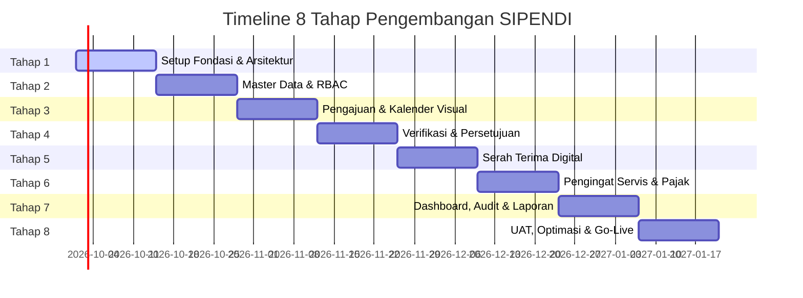
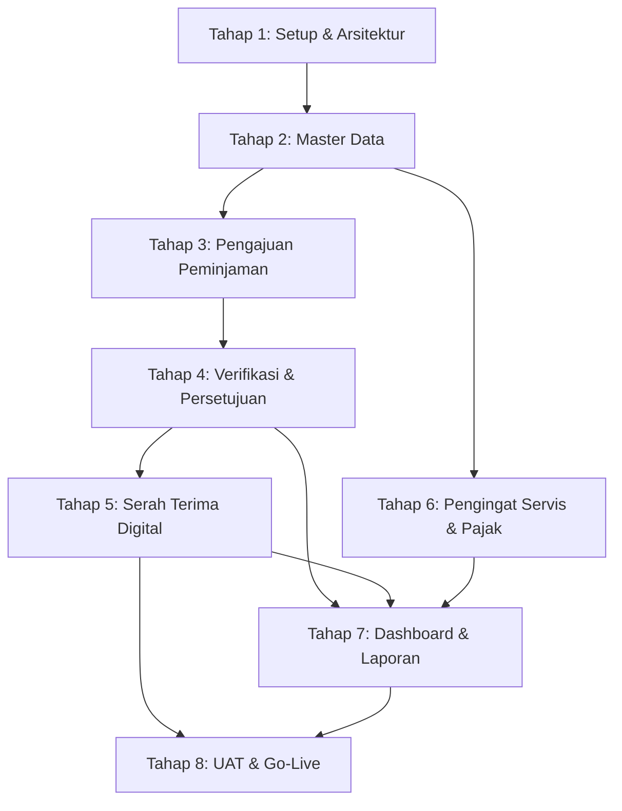

# SIPENDI — Timeline & Rencana 8 Tahap Pengembangan

**Sistem Peminjaman Kendaraan Dinas — RSUD Sidawangi**  
*Fase 1: Kendaraan Dinas Non-Ambulans*

| Parameter | Keterangan |
|---|---|
| **Versi Dokumen** | 1.0 |
| **Tanggal Pembuatan** | 22 September 2026 |
| **Dasar Rujukan** | [prd.md](file:///c:/laragon/www/sipendi/prd.md) |
| **Platform Teknologi** | PHP 8.3+ · Laravel 13 · Filament · Livewire 3 · Tailwind CSS · MySQL |
| **Total Estimasi** | 8 Tahap (16 Minggu / 4 Bulan Pelaksanaan) |

---

## Ringkasan Eksekutif Timeline

Dokumen ini memetakan 8 tahap pengembangan aplikasi **SIPENDI** secara terstruktur, berurutan, dan terukur. Pendekatan bertahap (*milestone-driven*) menjamin setiap komponen sistem dapat diuji dan divalidasi fungsinya sebelum melanjutkan ke modul berikutnya.

---

## Matriks Ikhtisar 8 Tahap

| Tahap | Fokus Utama | Estimasi Waktu | Basis Data Terkait | Peran Terlibat |
|---|---|---|---|---|
| **Tahap 1** | Setup Fondasi, Lingkungan & Arsitektur | Minggu 1 – 2 | Setup skema & koneksi | Admin IT, Developer |
| **Tahap 2** | Manajemen Pengguna & Master Data | Minggu 3 – 4 | `roles`, `unit_kerja`, `garasi`, `users`, `vehicle_categories`, `vehicles`, `drivers`, `settings` | Admin IT |
| **Tahap 3** | Pengajuan Peminjaman & Kalender Ketersediaan | Minggu 5 – 6 | `bookings` | User Aplikasi (Pemohon) |
| **Tahap 4** | Verifikasi Teknis & Persetujuan Berjenjang | Minggu 7 – 8 | `booking_approvals` | Kepala Garasi, Pimpinan |
| **Tahap 5** | Modul Serah Terima Digital (Checkout & Checkin) | Minggu 9 – 10 | `vehicle_checkouts`, `vehicle_checkins` | Kepala Garasi, Petugas |
| **Tahap 6** | Pengingat Otomatis Servis, Pajak & SIM (Cron) | Minggu 11 – 12 | `reminder_settings`, `vehicle_maintenances`, `vehicle_taxes` | Admin IT, Kepala Garasi |
| **Tahap 7** | Dashboard Eksekutif, Audit Trail & Laporan | Minggu 13 – 14 | `activity_logs`, agregasi statistik | Pimpinan, Kepala Garasi, Admin IT |
| **Tahap 8** | UAT, Keamanan, Optimasi & Go-Live | Minggu 15 – 16 | Verifikasi menyeluruh & Backup | Seluruh Peran |

---

## Rincian 8 Tahap Pengembangan

### Tahap 1: Fondasi Sistem, Lingkungan & Arsitektur Dasar
* **Periode:** Minggu 1 – 2
* **Tujuan:** Mempersiapkan lingkungan kerja pengembangan, kerangka kerja aplikasi, dependensi pustaka, dan tata letak UI standar RSUD Sidawangi.

#### Daftar Pekerjaan (Tasks):
- [x] Inisialisasi proyek Laravel (PHP 8.3+) dan konfigurasi file `.env` (koneksi MySQL/MariaDB, App Name, Timezone `Asia/Jakarta`).
- [x] Setup dan instalasi dependensi utama:
  - Filament Admin Panel.
  - `spatie/laravel-permission` (RBAC).
  - `spatie/laravel-activitylog` (Audit Trail).
  - Livewire 3 & Alpine.js.
  - Tailwind CSS & icon pack (Heroicons).
  - `barryvdh/laravel-dompdf` & `maatwebsite/excel`.
- [x] Konfigurasi penyimpanan berkas (`storage:link`) untuk dokumen dan foto fisik kendaraan.
- [x] Setup layout dasar antarmuka (Navbar, Sidebar, Mobile Header) yang konsisten dengan tema korporat RSUD Sidawangi.
- [x] Konfigurasi antrean background (*Queue Driver: database/redis*) dan driver email notifikasi.

#### Keluaran (Deliverables):
* Aplikasi Laravel dapat berjalan dengan sempurna di server lokal (Laragon).
* Panel backoffice Filament dasar dapat diakses dengan akun superadmin pertama.

---

### Tahap 2: Manajemen Pengguna, Organisasi & Master Data
* **Periode:** Minggu 3 – 4
* **Tujuan:** Menyediakan seluruh struktur data master dan antarmuka pengelolaannya bagi Admin IT sebelum transaksi peminjaman berjalan.

#### Daftar Pekerjaan (Tasks):
- [x] Pembuatan migrasi dan model basis data:
  - `roles` & `role_user` (4 peran: *Admin IT, User Aplikasi, Kepala Garasi, Pimpinan*).
  - `unit_kerja` (daftar unit/instalasi di RSUD).
  - `garasi` (lokasi pool kendaraan & PIC Kepala Garasi).
  - `users` (NIP, email, nomor HP, peran, unit kerja).
  - `vehicle_categories` (Minibus, Sedan, Pickup, dll).
  - `vehicles` (plat nomor, nomor rangka/mesin, kapasitas, foto, status, tanggal pajak/KIR, interval servis).
  - `drivers` (identitas sopir dinas pool, nomor SIM, masa berlaku SIM).
  - `settings` (nama instansi, logo RSUD, nomor kontak pool).
- [x] Database Seeder untuk data inisial peran, akun pengujian 4 peran, dan kategori kendaraan.
- [x] Pembuatan Filament Resources:
  - User & Role Management Resource.
  - Unit Kerja Resource & Garasi Resource.
  - Armada Kendaraan Resource (lengkap dengan upload foto & validasi input).
  - Sopir Dinas Resource.
- [x] Validasi status ketersediaan default kendaraan (*tersedia, dipinjam, maintenance, perlu_perhatian, nonaktif*).

#### Keluaran (Deliverables):
* Admin IT dapat menambah, memperbarui, dan menonaktifkan akun pegawai, kendaraan dinas, garasi, dan sopir melalui Filament.

---

### Tahap 3: Modul Pengajuan Peminjaman & Kalender Ketersediaan
* **Periode:** Minggu 5 – 6
* **Tujuan:** Memfasilitasi pegawai (User Aplikasi) untuk melihat ketersediaan kendaraan secara visual dan mengajukan permohonan peminjaman dinas secara mandiri.

#### Daftar Pekerjaan (Tasks):
- [x] Pembuatan migrasi dan model `bookings`:
  - Nomor referensi otomatis (`SPD/{unit}/{tahun}{bulan}/{urut}`).
  - Kolom tujuan, kota, tanggal & jam berangkat-kembali rencana, jumlah penumpang, jenis pengemudi (*sopir_dinas / swakemudi*).
  - Unggah berkas surat tugas dinas (PDF/gambar).
- [x] Pembuatan komponen UI Pemohon:
  - Formulir pengajuan interaktif (Livewire) dengan validasi tanggal berangkat < tanggal kembali.
  - Komponen **Kalender Visual Ketersediaan Kendaraan** (jadwal armada yang terisi vs yang kosong).
  - Algoritma validasi bentrok jadwal (*conflict schedule prevention*).
  - Pemfilteran kendaraan yang pajaknya kedaluwarsa atau berstatus `maintenance` agar tidak dapat dipilih.
- [x] Halaman "Peminjaman Saya":
  - Daftar riwayat pengajuan pemohon.
  - Pelacakan status (*badge*: Diajukan, Diverifikasi, Disetujui, Ditolak, Berjalan, Selesai).
  - Fitur pembatalan pengajuan oleh pemohon sebelum proses serah terima keluar.

#### Keluaran (Deliverables):
* Formulir peminjaman online berfungsi penuh, terhindar dari jadwal bentrok, dan riwayat pengajuan dapat dipantau pemohon.

---

### Tahap 4: Modul Verifikasi Teknis & Persetujuan Berjenjang
* **Periode:** Minggu 7 – 8
* **Tujuan:** Menerapkan alur persetujuan dua pintu yang akuntabel: Verifikasi Teknis (Kepala Garasi) → Persetujuan Akhir (Pimpinan).

#### Daftar Pekerjaan (Tasks):
- [x] Pembuatan migrasi dan model `booking_approvals` (merekam siapa approver, peran, tindakan: setuju/tolak, catatan alasan, timestamp).
- [x] **Alur Verifikasi Kepala Garasi:**
  - Antrean pengajuan dengan status `diajukan`.
  - Formulir penetapan unit kendaraan definitif dan sopir dinas yang bertugas.
  - Tombol tindakan: *Verifikasi & Teruskan ke Pimpinan* atau *Tolak Pengajuan* (wajib alasan penolakan).
- [x] **Alur Persetujuan Pimpinan:**
  - Antrean pengajuan dengan status `diverifikasi_garasi`.
  - Antarmuka *mobile-first* (ringkasan instan pemohon, tujuan, durasi, kendaraan yang disiapkan garasi).
  - Aksi *Setujui* (status menjadi `disetujui`) atau *Tolak* (status menjadi `ditolak_pimpinan`).
- [x] Sistem Notifikasi (In-App Database Notification & Email):
  - Notifikasi ke Kepala Garasi saat ada pengajuan baru.
  - Notifikasi ke Pimpinan saat pengajuan selesai diverifikasi teknis.
  - Notifikasi ke Pemohon saat pengajuan disetujui atau ditolak beserta catatannya.

#### Keluaran (Deliverables):
* Alur otorisasi berjenjang berjalan tanpa kertas (*paperless*), terekam di audit trail, dan memberi notifikasi *real-time*.

---

### Tahap 5: Modul Serah Terima Digital (Checkout & Checkin)
* **Periode:** Minggu 9 – 10
* **Tujuan:** Mencatat kondisi fisik, odometer, dan bahan bakar kendaraan saat serah terima keluar dan serah terima masuk guna mencegah sengketa kondisi armada.

#### Daftar Pekerjaan (Tasks):
- [x] Pembuatan migrasi dan model:
  - `vehicle_checkouts` (odometer keluar, BBM keluar: E/ 1/4/ 1/2/ 3/4/ F, checklist kelengkapan ban serep/dongkrak/P3K, foto fisik, tanda tangan/konfirmasi petugas).
  - `vehicle_checkins` (odometer masuk, BBM masuk, laporan kerusakan, checklist fisik, rating kondisi kendaraan 1–5, foto kondisi kembali).
- [x] **Alur Serah Terima Keluar (Checkout):**
  - Hanya dapat diakses untuk booking berstatus `disetujui`.
  - Form input digital checklist oleh petugas garasi.
  - Pengubahan status booking ke `kendaraan_keluar` dan status kendaraan ke `dipinjam`.
- [x] **Alur Serah Terima Masuk (Checkin):**
  - Form input saat kendaraan kembali ke pool.
  - Validasi odometer masuk harus $\ge$ odometer keluar.
  - Otomatis memperbarui kolom `odometer_terakhir` pada tabel `vehicles`.
  - Form pencatatan insiden kerusakan jika ada indikasi tabrakan/kerusakan selama masa dinas.
  - Pengubahan status booking ke `selesai` dan kendaraan kembali ke `tersedia`.
- [x] Fitur pelengkap: Generator & Scanner Kode QR per unit kendaraan untuk akses cepat ke form checkout/checkin.

#### Keluaran (Deliverables):
* Berita acara serah terima digital lengkap dengan bukti foto, data kilometer akurat, dan rekaman level BBM.

---

### Tahap 6: Pengingat Otomatis Servis, Pajak & SIM (Cron & Scheduler)
* **Periode:** Minggu 11 – 12
* **Tujuan:** Mengotomatiskan peringatan dini pemeliharaan armada dan kepatuhan administrasi kendaraan secara proaktif.

#### Daftar Pekerjaan (Tasks):
- [x] Pembuatan migrasi dan model:
  - `vehicle_maintenances` (riwayat servis rutin/berkala/perbaikan, bengkel, rincian biaya, nota).
  - `vehicle_taxes` (riwayat pembayaran pajak tahunan, 5 tahunan, uji KIR).
  - `reminder_settings` (konfigurasi ambang hari peringatan: default H-30, H-14, H-7, H-1).
- [x] Modul Pencatatan Pemeliharaan & Pajak di Filament:
  - Form input pencatatan pasca-servis oleh Kepala Garasi (otomatis memperbarui `tanggal_service_terakhir` dan `odometer_service_terakhir`).
  - Form input perpanjangan STNK/KIR (otomatis memperbarui masa berlaku di tabel kendaraan).
- [x] **Laravel Task Scheduler (Cron Engine):**
  - Job terjadwal harian (pukul 06.00 WIB) memeriksa:
    1. Interval servis (bulan & selisih kilometer odometer).
    2. Tanggal jatuh tempo pajak tahunan, 5 tahunan, dan KIR.
    3. Tanggal kedaluwarsa SIM sopir pool (H-30).
  - Logika otomatisasi: Kendaraan yang melewati tanggal pajak otomatis diubah statusnya menjadi `perlu_perhatian` dan dicegah dari pengajuan baru.
  - Pengiriman notifikasi bertahap ke Admin IT & Kepala Garasi (In-App & Email).
- [x] Antarmuka manajemen ambang batas pengingat (*Reminder Settings*) untuk Admin IT.

#### Keluaran (Deliverables):
* Pengingat otomatis bekerja mandiri setiap hari, mencegah kelalaian servis rutin dan keterlambatan pembayaran pajak/KIR.

---

### Tahap 7: Dashboard Eksekutif, Audit Trail & Pelaporan Lanjutan
* **Periode:** Minggu 13 – 14
* **Tujuan:** Menyajikan analisis data utilisasi armada untuk Pimpinan serta fasilitas pelaporan administratif resmi.

#### Daftar Pekerjaan (Tasks):
- [x] Pembuatan migrasi dan model `activity_logs` serta konfigurasi logger Spatie pada model `Booking`, `Vehicle`, `User`, `VehicleCheckout`.
- [x] **Desain Dashboard Spesifik Peran:**
  - **Dashboard Pimpinan:**
    - Widget KPI: Tingkat utilisasi armada, jumlah peminjaman bulan ini, rata-rata durasi persetujuan.
    - Grafik: Frekuensi peminjaman berdasarkan unit kerja pemohon.
    - Grafik perbandingan: Kendaraan paling sering digunakan vs jarang digunakan.
  - **Dashboard Kepala Garasi:**
    - Indikator status armada (*Tersedia, Dipinjam, Maintenance, Perlu Perhatian*).
    - Tabel pengingat servis & pajak terdekat (< 30 hari).
    - Rata-rata rating kebersihan/kondisi kendaraan yang dikembalikan.
  - **Dashboard Admin IT:**
    - Log aktivitas pengguna secara real-time.
    - Status antrean pekerjaan latar belakang (*queue health*).
- [x] **Modul Laporan & Ekspor:**
  - Filter rekapitulasi berdasarkan rentang tanggal, unit kerja, kendaraan, dan nama sopir.
  - Ekspor laporan perjalanan dinas ke format **PDF** siap cetak (kop surat RSUD Sidawangi).
  - Ekspor rekapitulasi data operasional ke format **Excel (.xlsx)** untuk keperluan audit keuangan & operasional.

#### Keluaran (Deliverables):
* Pimpinan memiliki dashboard analitik untuk pertimbangan penambahan/peremajaan unit, dan laporan operasional dapat diunduh instan.

---

### Tahap 8: Pengujian (UAT), Pengerasan Keamanan, Optimasi & Go-Live
* **Periode:** Minggu 15 – 16
* **Tujuan:** Memvalidasi keseluruhan sistem di lingkungan simulasi bersama pemangku kepentingan RSUD Sidawangi dan meluncurkannya ke produksi.

#### Daftar Pekerjaan (Tasks):
- [x] **Pengujian Fungsional & UAT (User Acceptance Test):**
  - Simulasi pengujian skenario lengkap 4 peran (Pemohon buat pengajuan $\to$ Garasi verifikasi $\to$ Pimpinan setujui $\to$ Petugas checkout $\to$ Petugas checkin $\to$ Cron reminder jalan).
  - Pengujian skenario penolakan (alasan penolakan tampil jelas pada pemohon).
  - Pengujian pencegahan jadwal ganda (*race condition/overlap*).
- [x] **Pengerasan Keamanan & Kepatuhan:**
  - Audit hak akses (*authorization gates & policies*) pada setiap endpoint.
  - Pembatasan akses unduh berkas surat tugas & foto kerusakan kendaraan (hanya pihak berwenang).
  - Sanitasi input dan proteksi CSRF/XSS serta penerapan *Rate Limiting*.
- [x] **Optimasi Performa:**
  - Eager loading query Eloquent untuk mengeliminasi problem *N+1 query*.
  - Kompresi otomatis pada unggahan foto serah terima agar hemat media penyimpanan server.
  - Pengujian responsivitas tata letak di berbagai resolusi layar ponsel.
- [x] **Persiapan Produksi & Go-Live:**
  - Setup konfigurasi server produksi (Nginx/Apache Laragon, Supervisor worker, Cron OS).
  - Migrasi data awal kendaraan riil RSUD Sidawangi.
  - Penyusunan buku manual pengguna ringkas (*User Guide PDF* untuk 4 peran).
  - Serah terima resmi dan *Go-Live* operasional SIPENDI Fase 1.

#### Keluaran (Deliverables):
* Sistem SIPENDI Fase 1 beroperasi penuh di lingkungan RSUD Sidawangi, terbebas dari bug kritis, dan digunakan secara resmi oleh pegawai.

---

## Matriks Ketergantungan Antar Tahap (*Dependency Matrix*)

---

## Manajemen Risiko Pelaksanaan Proyek

| Risiko Potensial | Tahap Terkait | Strategi Mitigasi |
|---|---|---|
| **Data spesifikasi & masa pajak kendaraan belum lengkap** | Tahap 2 | Sediakan fitur impor Excel massal dengan template khusus dan izinkan data tentatif yang dapat dilengkapi kemudian. |
| **Keterlambatan respons persetujuan dari Pimpinan** | Tahap 4 | Sediakan antarmuka ringkas mobile yang dapat diakses dalam 1 kali klik dan notifikasi pengingat susulan (*escalation*). |
| **Foto serah terima memberatkan kapasitas server** | Tahap 5 | Pasang script kompresi gambar otomatis saat upload (*max width 1200px, quality 80%*). |
| **Pesan notifikasi email masuk folder spam** | Tahap 6 | Gunakan SMTP terpercaya dengan konfigurasi SPF & DKIM yang tepat pada domain instansi. |
| **Resistensi staf terhadap sistem baru** | Tahap 8 | Berikan bimbingan teknis (*walkthrough*) langsung ke Kepala Garasi dan perwakilan unit kerja sebelum sistem diwajibkan. |

---

## Lembar Pemantauan Progres Proyek

Beri tanda centang `[x]` pada tahap yang telah selesai dikerjakan:

- [x] **Tahap 1:** Setup Fondasi, Lingkungan & Arsitektur Dasar
- [x] **Tahap 2:** Manajemen Pengguna, Organisasi & Master Data
- [x] **Tahap 3:** Modul Pengajuan Peminjaman & Kalender Ketersediaan
- [x] **Tahap 4:** Modul Verifikasi Teknis & Persetujuan Berjenjang
- [x] **Tahap 5:** Modul Serah Terima Digital (Checkout & Checkin)
- [x] **Tahap 6:** Pengingat Otomatis Servis, Pajak & SIM (Cron)
- [x] **Tahap 7:** Dashboard Eksekutif, Audit Trail & Pelaporan Lanjutan
- [x] **Tahap 8:** Pengujian (UAT), Pengerasan Keamanan, Optimasi & Go-Live
